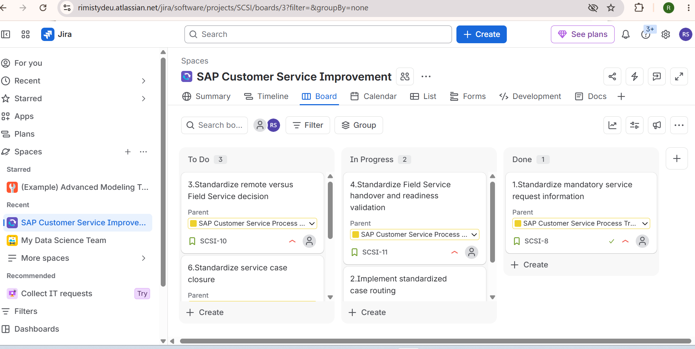
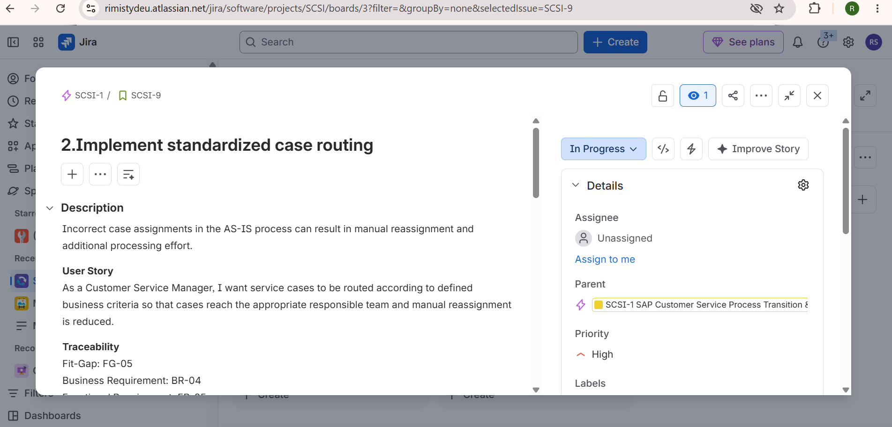

# SAP Customer Service Process Improvement

## Application Process Management Portfolio Case Study

This project is a self-developed portfolio case study demonstrating an end-to-end **Application Process Management lifecycle** for the transition and improvement of a Salesforce-based Customer Service process toward an integrated SAP service landscape.

The case study focuses on business process analysis, SAP-supported process design, requirements engineering, Jira change management, UAT, release coordination and continuous improvement.

> **Portfolio Disclaimer:**  
> This is a simulated case study created for learning and portfolio demonstration.  
> It does not represent a productive SAP implementation or employment-based SAP project experience.

---

## Project Objective

The objective was to analyze an existing Customer Service process, identify improvement opportunities and design a standardized future-state process supported by:

- SAP Service Cloud
- SAP S/4HANA
- Field Service capabilities
- SAP Signavio
- Jira

The project demonstrates the lifecycle:

**AS-IS → Fit-Gap → TO-BE → Requirements → Jira → Acceptance Criteria → UAT → Release → Hypercare**

---

# Business Scenario

The existing Customer Service process is based on a customer-facing portal connected to Salesforce.

The current process is operational, but the transition toward an SAP-supported service landscape provides an opportunity to improve:

- Service-request information quality
- Case categorization
- Case prioritization
- Case routing
- Remote diagnosis
- Field Service handover
- Field Service readiness
- Status visibility
- Service-result feedback
- Case closure
- Process monitoring

---

# AS-IS Process

The existing process follows the high-level flow:

**Customer Request → Salesforce Case → Information Review → Categorization & Priority → Assignment → Investigation → Remote Diagnosis**

If the issue can be resolved remotely:

**Remote Solution → Customer Communication → Case Closure**

If on-site work is required:

**Field Service Handover → Dispatcher / Planner → Technician Scheduling → On-Site Service → Service Result → Customer Service → Closure**

### AS-IS BPMN


The AS-IS process was modelled using **SAP Signavio and BPMN**.

---

# Key Improvement Opportunities

The analysis identified several areas for improvement:

| Area | AS-IS Challenge | TO-BE Direction |
|---|---|---|
| Request Information | Missing information creates clarification loops | Mandatory information validation |
| Case Categorization | Inconsistent classification | Standardized categories |
| Priority | Different prioritization approaches | Defined priority rules |
| Case Routing | Incorrect assignments and reassignment | Rule-based routing |
| Remote Diagnosis | Documentation varies | Standardized troubleshooting |
| Field Service Decision | Decision criteria may differ | Defined escalation criteria |
| Field Service Handover | Information may be incomplete | Standardized handover |
| Field Service Readiness | Missing information delays planning | Readiness validation |
| Status Visibility | Limited end-to-end visibility | Structured status feedback |
| Closure | Closure information may vary | Standard closure criteria |
| Monitoring | Limited KPI visibility | Defined process KPIs |

---

# Fit-Gap Analysis

A structured Fit-Gap Analysis was created to evaluate the existing process against future-state business requirements.

Each process area was classified as:

- **Fit**
- **Partial Fit / Improvement**
- **Gap**

The analysis focused on **business and process needs**, rather than simply comparing Salesforce and SAP functionality.

Example:

**Incorrect case assignment → FG-05 → Routing Gap → Rule-based routing required**

The complete Fit-Gap workbook is available here:

[`03_Fit-Gap_Analysis/Fit_Gap_Analysis.xlsx`](03_Fit-Gap_Analysis/Fit_Gap_Analysis.xlsx)

---
# Target SAP Landscape

The conceptual target landscape is:

```text
Customer
   ↓
Customer Portal
   ↓
SAP Service Cloud
   ↕
SAP S/4HANA
```

When physical on-site activity is required:

```text
SAP Service Cloud
      ↓
Field Service Process
      ↓
Dispatcher / Planner
      ↓
Field Technician
      ↓
Service Result
      ↓
SAP Backend / Customer Service Case
```

---

## Responsibility Overview

### SAP Service Cloud

SAP Service Cloud represents the customer-service and case-management layer in the conceptual target landscape.

# Requirement Traceability

A traceability chain was maintained throughout the case study:

```text
AS-IS Observation
        ↓
Fit-Gap Analysis
        ↓
Business Requirement
        ↓
Functional Requirement
        ↓
Jira Story
        ↓
Acceptance Criteria
        ↓
UAT Test Case
```

### Example – Case Routing

```text
Incorrect Case Assignment
        ↓
FG-05
        ↓
BR-04
        ↓
FR-05
        ↓
SCSI-9
        ↓
Routing Acceptance Criteria
        ↓
UAT-02
```

This ensures that an application or process change remains connected to an identified business need and can later be validated through testing.

---
---

# Jira Change Management

A Jira project was created to simulate application change management for the proposed Customer Service improvements.

## Epic

**SAP Customer Service Process Transition & Improvement**

Representative Jira Stories included:

- **SCSI-8** – Standardize mandatory service request information
- **SCSI-9** – Implement standardized case routing
- **SCSI-10** – Standardize remote versus Field Service decision
- **SCSI-11** – Standardize Field Service handover and readiness validation
- **SCSI-12** – Provide Field Service status and result visibility
- **SCSI-13** – Standardize service case closure

## Jira Workflow



## Representative Story – SCSI-9 Case Routing



The representative Story includes:

- Business context
- User Story
- Requirement traceability
- Target application area
- Business value
- Acceptance criteria

Acceptance criteria were documented using the **Given–When–Then** format.

### Example Acceptance Criterion

**Given** a service case has a defined category,  
**When** routing is executed,  
**Then** the case is assigned to the responsible team according to the approved routing rules.

---

# User Acceptance Testing

Representative User Acceptance Testing (UAT) scenarios were created to validate the business requirements.

Testing covered:

- Mandatory service-request information
- Standardized case routing
- Remote versus Field Service decision
- Field Service handover readiness
- Field Service status and result visibility
- Standardized case closure

### Example – UAT-02

**Scenario:** Validate standardized case routing.

**Test:** Create a service case with a category mapped to a defined responsible team and execute the routing process.

**Expected Result:** The case is assigned to the expected responsible team according to the approved routing rules.

The complete UAT workbook is available here:

[`07_UAT_Testing/UAT_Test_Cases.xlsx`](07_UAT_Testing/UAT_Test_Cases.xlsx)

> **Case Study Note:** UAT execution and results are simulated for portfolio purposes. In a real implementation, formal UAT would be performed and approved by authorized business key users.

---

# Release & Implementation

The high-level release lifecycle used in the case study is:

```text
Approved Requirements
        ↓
Configuration / Development
        ↓
Technical & Integration Testing
        ↓
UAT
        ↓
Business Approval
        ↓
Production Deployment
        ↓
Validation
        ↓
Hypercare
        ↓
Normal Operations
```

## Release Readiness

The release approach includes:

- Approved business and functional requirements
- Confirmed release scope
- Functional testing
- Integration testing where applicable
- UAT
- Critical defect resolution
- Business approval
- User and process documentation
- Stakeholder communication
- Deployment planning
- Support responsibilities
- Rollback / contingency planning

Technical deployment would be performed by the appropriate SAP functional, technical and release teams.

The Application Process Manager supports the business and process perspective by coordinating requirements, validation, readiness, communication and post-go-live activities.

---

# Hypercare & Continuous Improvement

Following go-live, the process enters a focused hypercare period.

Potential monitoring areas include:

- User issues
- Incorrect case routing
- Integration problems
- Field Service handover problems
- Missing or incorrect status updates
- Process exceptions
- User feedback

Issues can then be analyzed and converted into further process or application improvements where required.

---

# Post-Go-Live KPI Framework

Potential Customer Service KPIs include:

| KPI | Purpose |
|---|---|
| Case Volume | Monitor workload and service demand |
| First Response Time | Measure responsiveness |
| Resolution Time | Monitor service efficiency |
| Reassignment Rate | Identify routing quality |
| SLA Compliance | Monitor service-level performance |
| Field Service Handover Rework | Identify incomplete handovers |
| Remote Resolution Rate | Measure cases resolved without on-site intervention |
| Field Service Escalation Rate | Monitor on-site service demand |
| Case Closure Quality | Monitor completeness and consistency |

Final KPI definitions and targets would be agreed with the relevant business and process owners.

---

# Tools & Methods

| Tool / Method | Usage in Case Study |
|---|---|
| SAP Signavio | AS-IS and TO-BE process modelling |
| BPMN | End-to-end process visualization |
| SAP Service Cloud | Customer Service / case-management target concept |
| SAP S/4HANA | ERP/backend integration concept |
| Field Service | On-site service process concept |
| Jira | Epic, Stories, workflow and acceptance criteria |
| Microsoft Excel | Fit-Gap Analysis and UAT |
| Microsoft Word / PDF | Process, requirements and release documentation |
| Microsoft PowerPoint | Management-oriented project presentation |

---

# Project Structure

```text
SAP-Customer-Service-Process-Improvement/
│
├── 01_Business_Context/
│   └── Business_Context.pdf
│
├── 02_AS-IS_Process/
│   ├── AS-IS process documentation
│   └── AS-IS BPMN process model
│
├── 03_Fit-Gap_Analysis/
│   └── Fit_Gap_Analysis.xlsx
│
├── 04_TO-BE_Process/
│   ├── TO-BE process documentation
│   └── TO-BE BPMN process model
│
├── 05_Requirements/
│   └── Business_Functional_Requirements.pdf
│
├── 06_Jira_Change_Management/
│   ├── Jira workflow
│   └── Representative case-routing Story
│
├── 07_UAT_Testing/
│   └── UAT_Test_Cases.xlsx
│
├── 08_Release_Implementation/
│   └── Release_Implementation_Plan.pdf
│
├── 09_Documentation/
│   └── Case_Study_Summary.pdf
│
└── 10_Presentation/
    ├── Case Study Presentation.pdf
    └── Case Study Presentation.pptx
```

---

# Executive Presentation

A concise management-oriented presentation summarizes the complete case study.

### Presentation PDF

[`View the SAP Customer Service Process Improvement Presentation`](10_Presentation/SAP_Customer_Service_Process_Improvement_Case_Study.pdf)

The editable **PowerPoint (.pptx)** version is also available in the `10_Presentation` folder.

The presentation provides an executive overview of:

**Business Scenario → AS-IS → Fit-Gap → SAP Target Landscape → TO-BE → Requirements → Jira → UAT → Release → Business Value**

---

# Skills Demonstrated

### Business Process Management

- AS-IS Process Analysis
- TO-BE Process Design
- BPMN
- SAP Signavio
- Fit-Gap Analysis
- Process Improvement

### Requirements & Application Management

- Requirements Engineering
- Business Requirements
- Functional Requirements
- Requirement Traceability
- Acceptance Criteria
- Jira Change Management

### SAP Process Understanding

- SAP Service Cloud
- SAP S/4HANA integration concepts
- Customer Service processes
- Field Service processes
- Customer, equipment and service information flows

### Testing & Change Management

- User Acceptance Testing
- Test Scenario Design
- Release Readiness
- Stakeholder Communication
- Hypercare
- Continuous Improvement
- KPI Definition

---

# Application Process Manager Perspective

The case study demonstrates the Application Process Manager as a bridge between:

**Business Users ↔ Business Processes ↔ Applications / SAP Teams ↔ Testing ↔ Release ↔ Operations**

The role is not to personally perform every technical configuration.

The focus is to:

1. Understand the end-to-end business process.
2. Identify process and application improvement opportunities.
3. Translate business needs into clear requirements.
4. Coordinate business and application stakeholders.
5. Maintain requirement traceability.
6. Support testing and business validation.
7. Coordinate release readiness from the process perspective.
8. Support post-go-live issue analysis and continuous improvement.

---

# Key Project Principle

> **Business problem first — system solution second.**

Rather than treating every difference between Salesforce and SAP as a gap, this case study evaluates the underlying business process first and determines what should be retained, standardized or improved.

---

# Portfolio Disclaimer

This repository contains a **self-developed portfolio case study** created to demonstrate Application Process Management methodology and practical learning.

It does **not** represent a productive SAP implementation or employment-based SAP project experience.

The SAP landscape, requirements, Jira workflow, UAT execution and release activities are simulated to demonstrate understanding of an end-to-end application and process change lifecycle.

---

# Project Summary

**AS-IS → Fit-Gap → TO-BE → Requirements → Jira → Acceptance Criteria → UAT → Release → Hypercare → Continuous Improvement**

This project demonstrates how a business-process problem can be systematically translated into application requirements, controlled changes, business validation and continuous process improvement.
